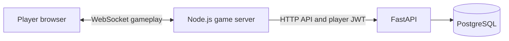

# Session Management Microservice

A FastAPI/PostgreSQL service for accounts, presence, and session discovery used by server-based applications, including Node.js WebSocket games.



The game server owns gameplay, rooms, membership, timers, and scoring. This API stores accounts and discoverable session records. Browsers use the game server; they do not need direct database or API access. The `/v1` API authenticates scoped service credentials and supports tenant-isolated players and multiple rooms per server. The bundled trivia example retains the player-JWT compatibility API. See [service contracts](docs/services.md) and the [transition guide](docs/api-transition.md).

## Current scope

- User registration, login, profile lookup, presence logout, and account deletion.
- Admin-only user creation, lookup, and deletion.
- Session creation, host/code discovery, updates, and deletion.
- Authenticated friend requests, acceptance, rejection, cancellation, friend lists, and removal.
- A 1–4 player [Euchre demo](example-implementation/README.md#euchre) with bots, friendships, and leased service rooms.
- A [Node.js WebSocket trivia example](example-implementation/) with player workflows and a separate administrator endpoint exercise.

Friendship APIs are available under `/friends`. Persistent messaging remains deferred; retained legacy SQL and account cleanup are documented in [the social capability decision](docs/legacy-social.md). Steam is optional; account IDs and neutral subjects are generated server-side. Legacy Steam fields and `beacon_metadata` remain for compatibility. Logout increments the persistent token version, so old JWTs remain revoked after subsequent logins and database restarts. The repository includes a disposable PostgreSQL CI contract suite and a bounded load probe; the load probe reports targets but is not a production capacity claim.

## Complete Docker demo

Start the API, database, and WebSocket trivia game together:

```sh
docker-compose -f example-implementation/docker-compose.yml up --build -d --wait
```

Open http://127.0.0.1:3000 in two windows. The game calls the API container directly; PostgreSQL initializes automatically on the first boot. Only the game port is published. This local demo uses its own persistent volume and development credentials, with no environment file required. See [the demo instructions](example-implementation/README.md#run-the-complete-demo-with-docker) for port overrides, logs, shutdown, and administrator setup.

To play Euchre with the same API and persistent database:

```sh
./example-implementation/run-demo.sh --euchre-example
```

Use separate browser profiles for each player. See the [Euchre walkthrough and endpoint mapping](example-implementation/README.md#euchre).

## Local setup

Requirements: a running, accessible Docker Engine with `docker-compose`. Local development uses Python 3.12 and Node.js 22 or 24. See [setup, configuration, migrations, and backups](docs/operations.md).

From the repository root:

```sh
cp .env.example src/.env
# Edit src/.env and replace SECRET_KEY with a random secret.
docker-compose --env-file src/.env -f src/docker-compose.yml up --build
```

The API listens on `http://localhost:8000`. Interactive API documentation is at `/docs`, and the machine-readable contract is at `/openapi.json`. `GET /` reports process liveness; `/health/ready` checks initialized database tables.

PostgreSQL initialization runs only on an empty data volume. API startup applies versioned migrations to existing databases. Follow the [backup and upgrade procedure](docs/operations.md#migrations-and-existing-data); preserve volumes and data.

Create the first administrator from a trusted local shell when testing admin-only routes. The command prompts for a password and refuses to run if an administrator already exists:

```sh
docker-compose --env-file src/.env -f src/docker-compose.yml exec api python bootstrap_admin.py --username trivia-service
```

For the game setup, player walkthrough, endpoint coverage, and operator workflow, follow [the example README](example-implementation/README.md).

## API contract

Protected routes require `Authorization: Bearer <player-token>`. Login uses an OAuth2 form body; registration and session requests use JSON. The existing session-create request has two nested objects, `session` and `beacon_metadata`; refer to `/docs` or the example API client for exact fields.

| Capability     | Routes                                                                                                                                                                                       |
| -------------- | -------------------------------------------------------------------------------------------------------------------------------------------------------------------------------------------- |
| Liveness       | `GET /`                                                                                                                                                                                      |
| Accounts       | `POST /users/register`, `POST /users/login`, `GET /users/me`, `POST /users/logout`, `DELETE /users/delete_me`                                                                                |
| Friends | `GET /friends`, `GET /friends/requests`, `POST /friends/requests`, `POST /friends/requests/{request_id}`, `DELETE /friends/{friend_id}` |
| Administration | `POST /users/register_admin`, `GET /users/get_user`, `DELETE /users/delete`                                                                                                                  |
| Sessions       | `POST /sessions/create`, `GET /sessions/read_friend_session`, `GET /sessions/read_friend_session_data`, `GET /sessions/read_session_data`, `PUT /sessions/update`, `DELETE /sessions/delete` |

The `read_friend_session` names are legacy host lookup routes; actual access depends on the stored session policy. Authenticated friendship operations are documented in [the social API contract](docs/legacy-social.md). Automatic FastAPI documentation routes are not gameplay endpoints.

## Tests

Run the backend regression tests (database calls are substituted; these do not validate PostgreSQL initialization):

```sh
python3.12 -m venv .venv
.venv/bin/pip install --require-hashes -r src/requirements-test.txt
.venv/bin/python -m pytest src/tests
```

Run the example tests:

```sh
cd example-implementation
npm ci
npm test
```

Run the Python lint check:

```sh
.venv/bin/python -m ruff check src/app src/tests tests/integration
```

The example README also describes mock mode and the live API walkthrough. A successful mock test does not establish database integration correctness. CI runs the complete disposable PostgreSQL workflow, including migrations, all application routes, adversarial token checks, the privileged operator lifecycle, restart recovery, the live two-player WebSocket game, and a bounded concurrency/pool probe.

## Deployment checklist

Terminate browser and game traffic with TLS, set `APP_ENV=production`, and keep PostgreSQL and the FastAPI API on private networks. Configure `PUBLIC_ORIGIN` and the API's allowed origins explicitly; do not use wildcard origins with credentials. Inject `SECRET_KEY`, database credentials, and bootstrap credentials through the deployment secret store, never source control or browser configuration.

Grant the application database user only the schema rights required by migrations and runtime queries. Take encrypted backups, test restores into a separate database, and preserve volumes during upgrades. Run the API readiness check from orchestration, monitor `/metrics` and structured request logs, and size game-server replicas with shared state and cleanup/lease behavior before exposing the service publicly.

## Development priorities

[ToDo.md](ToDo.md) records prioritized work and acceptance criteria for completing the API, making trusted server-based services first-class, implementing or deferring unfinished social features, and establishing integration and release testing.

Keep the API and database on a private network in a server deployment, with the game server as the player-facing entry point. The local example is intended for development and API evaluation.

## License

[MIT](LICENSE.txt).
