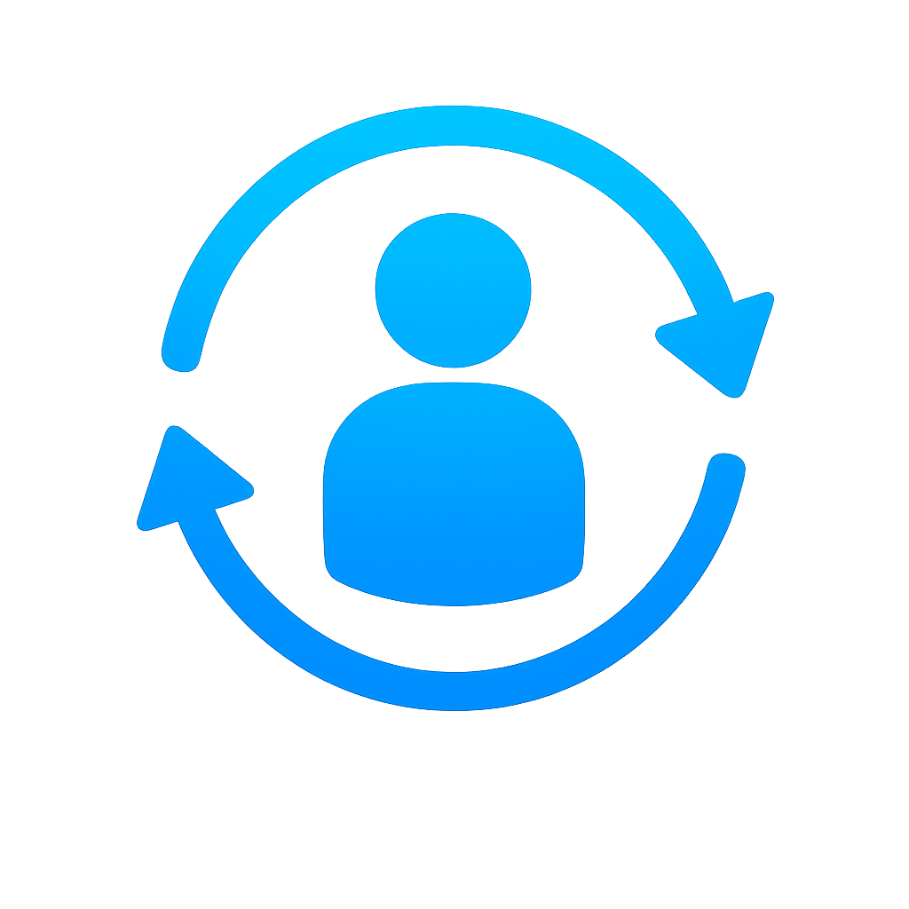
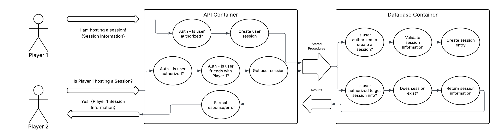

[![Contributors][contributors-shield]][contributors-url]
[![Forks][forks-shield]][forks-url]
[![Stargazers][stars-shield]][stars-url]
[![Issues][issues-shield]][issues-url]
[![project_license][license-shield]][license-url]
[![LinkedIn][linkedin-shield]][linkedin-url]


<br />
<div align="center">
  <a href="https://github.com/JDubbs89/session-management-microservice">
    
  </a>

<h3 align="center">Session Management Microservice</h3>

  <p align="center">
    A lightweight, robust game session management microservice.
    <br />
    <a href="https://github.com/JDubbs89/session-management-microservice/issues/new?labels=bug&template=bug-report---.md">Report Bug</a>
    &middot;
    <a href="https://github.com/JDubbs89/session-management-microservice/issues/new?labels=enhancement&template=feature-request---.md">Request Feature</a>
  </p>
</div>


<details>
  <summary>Table of Contents</summary>
  <ol>
    <li>
      <a href="#about-the-project">About The Project</a>
      <ul>
        <li><a href="#built-with">Built With</a></li>
      </ul>
    </li>
    <li>
      <a href="#getting-started">Getting Started</a>
      <ul>
        <li><a href="#prerequisites">Prerequisites</a></li>
        <li><a href="#installation">Installation</a></li>
      </ul>
    </li>
    <li><a href="#usage">Usage</a></li>
    <li><a href="#roadmap">Roadmap</a></li>
    <li><a href="#license">License</a></li>
    <li><a href="#contact">Contact</a></li>
    <li><a href="#acknowledgments">Acknowledgments</a></li>
  </ol>
</details>

## About the Project
This project is a session management microservice designed for interacting with P2P session systems in multiplayer games. Games should interact with the API server to create, read, update, and delete user, session, and message data held within the database container. This project is meant to be a lightweight and self-contained solution for games that utilize P2P multiplayer, but don't want/need to implement relay server overhead.

### Features
- JWT and OAuth2 authentication
- Password hashing with B-Crypt
- Rate Limiting and input validation/sanitation
- User login status, last activity data
- User friendships, messages (W.I.P.), and session data
- Comprehensive and dynamic test cases (W.I.P.)

### Built With

* [](#)
* [](#)
* [](#)
* [](#)
* [](#)
* [](#)
* [](#)
* [](#)

### API
FastAPI spearheads the API layer. The API makes use of CRUD functionality powered by SQLAlchemy. Pydantic provides data models critical for input validation/sanitation. The login endpoint utilizes BCrypt to hash the password before sending it to the database, and returns a JWT upon authentication for future logins. SlowAPI handles rate limiting based on network address, safeguarding against brute force/DDoS attacks.

### Database
PostgreSQL is the database of choice in this project. The DB makes use of stored procedures to provide CRUD functionality without allowing the client access to the database. On top of using stored procedures, each operation thoroughly validates the executing user based on criteria such as session ownership, friendship status, etc. to ensure data privacy and security.

## Getting Started (UNDER CONSTRUCTION)

This is an example of how you may give instructions on setting up your project locally.
To get a local copy up and running follow these simple example steps.

### Prerequisites (UNDER CONSTRUCTION)

This is an example of how to list things you need to use the software and how to install them.
* npm
  ```sh
  npm install npm@latest -g
  ```

### Installation (UNDER CONSTRUCTION)

1. Get a free API Key at [https://example.com](https://example.com)
2. Clone the repo
   ```sh
   git clone https://github.com/github_username/repo_name.git
   ```
3. Install NPM packages
   ```sh
   npm install
   ```
4. Enter your API in `config.js`
   ```js
   const API_KEY = 'ENTER YOUR API';
   ```
5. Change git remote url to avoid accidental pushes to base project
   ```sh
   git remote set-url origin github_username/repo_name
   git remote -v # confirm the changes
   ```

<p align="right">(<a href="#readme-top">back to top</a>)</p>


## Usage

Below is a basic flowchart outlining the process by which a game client sends HTTP requests to the API, which in turn performs CRUD operations on the database.

<a href="https://github.com/JDubbs89/session-management-microservice">
    
</a>

In this specific instance, Player 1 begins hosting a session, notifying the microservice via HTTP post request containing relevant session data. Player 2 want to see if player 1 is hosting a session and retrieve that relevant data if possible. Both requests go through authentication on both the API side and database side for security reasons.

<p align="right">(<a href="#readme-top">back to top</a>)</p>


## Roadmap (UNDER CONSTRUCTION)

- [ ] Feature 1
- [ ] Feature 2
- [ ] Feature 3
    - [ ] Nested Feature

See the [open issues](https://github.com/github_username/repo_name/issues) for a full list of proposed features (and known issues).

<p align="right">(<a href="#readme-top">back to top</a>)</p>

## License

Distributed under the MIT License. See `LICENSE.txt` for more information.

<p align="right">(<a href="#readme-top">back to top</a>)</p>

## Contact

Jonathan Warner - jdwarner8989@gmail.com

Project Link: [https://github.com/github_username/session-management-microservice](https://github.com/github_username/session-management-microservice)

<p align="right">(<a href="#readme-top">back to top</a>)</p>

## Acknowledgments

* [ArjanCodes - Youtube](https://www.youtube.com/@ArjanCodes)
* [W3Schools.org](https://www.w3schools.com/)
* [Postman Blog - How to Build an API](https://blog.postman.com/how-to-build-an-api/)

<p align="right">(<a href="#readme-top">back to top</a>)</p>

[contributors-shield]: https://img.shields.io/github/contributors/JDubbs89/session-management-microservice.svg?style=for-the-badge
[contributors-url]: https://github.com/JDubbs89/session-management-microservice/graphs/contributors
[forks-shield]: https://img.shields.io/github/forks/JDubbs89/session-management-microservice.svg?style=for-the-badge
[forks-url]: https://github.com/JDubbs89/session-management-microservice/network/members
[stars-shield]: https://img.shields.io/github/stars/JDubbs89/session-management-microservice.svg?style=for-the-badge
[stars-url]: https://github.com/JDubbs89/session-management-microservice/stargazers
[issues-shield]: https://img.shields.io/github/issues/JDubbs89/session-management-microservice.svg?style=for-the-badge
[issues-url]: https://github.com/JDubbs89/session-management-microservice/issues
[license-shield]: https://img.shields.io/github/license/JDubbs89/session-management-microservice.svg?style=for-the-badge
[license-url]: https://github.com/JDubbs89/session-management-microservice/blob/master/LICENSE.txt
[linkedin-shield]: https://img.shields.io/badge/-LinkedIn-black.svg?style=for-the-badge&logo=linkedin&colorB=555
[linkedin-url]: https://linkedin.com/in/jonathanwarnercs
