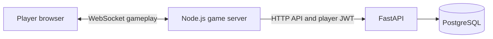

# Session Management Microservice

A FastAPI/PostgreSQL service for accounts, presence, and session discovery used by server-based applications, including Node.js WebSocket games.



The game server owns gameplay, rooms, membership, timers, and scoring. This API stores accounts and discoverable session records. Browsers use the game server; they do not need direct database or API access. The current API authenticates player JWTs; scoped service identities and multi-room server ownership are planned in [ToDo.md](ToDo.md).

## Current scope

- User registration, login, profile lookup, presence logout, and account deletion.
- Admin-only user creation, lookup, and deletion.
- Session creation, host/code discovery, updates, and deletion.
- A [Node.js WebSocket trivia example](example-implementation/) with player workflows and a separate administrator endpoint exercise.

Friendship and messaging router files are placeholders, not available endpoints. Legacy Steam fields and `beacon_metadata` remain for compatibility. Logout marks the account offline and rejects protected requests while offline. It does not permanently revoke a JWT; an unexpired token can become usable again after another login. This is a development baseline; the roadmap tracks service authentication, migrations, access-policy hardening, and release checks.

## Complete Docker demo

Start the API, database, and WebSocket trivia game together:

```sh
docker-compose -f example-implementation/docker-compose.yml up --build -d --wait
```

Open http://127.0.0.1:3000 in two windows. The game calls the API container directly; PostgreSQL initializes automatically on the first boot. Only the game port is published. This local demo uses its own persistent volume and development credentials, with no environment file required. See [the demo instructions](example-implementation/README.md#run-the-complete-demo-with-docker) for port overrides, logs, shutdown, and administrator setup.

## Local setup

Requirements: Docker Engine with `docker-compose`, and Node.js 22 or newer for the example.

From the repository root:

```sh
cp .env.example src/.env
# Edit src/.env and replace SECRET_KEY with a random secret.
docker-compose --env-file src/.env -f src/docker-compose.yml up --build
```

The API listens on `http://localhost:8000`. Interactive API documentation is at `/docs`, and the machine-readable contract is at `/openapi.json`. `GET /` reports process liveness, not database readiness.

PostgreSQL initialization runs only on an empty data volume. SQL edits do not migrate an existing database; use a separate fresh development database to test initialization. Preserve existing volumes and data.

Create the first administrator from a trusted local shell when testing admin-only routes. The command prompts for a password and refuses to run if an administrator already exists:

```sh
docker-compose --env-file src/.env -f src/docker-compose.yml exec api python bootstrap_admin.py --username trivia-service
```

For the game setup, player walkthrough, endpoint coverage, and operator workflow, follow [the example README](example-implementation/README.md).

## API contract

Protected routes require `Authorization: Bearer <player-token>`. Login uses an OAuth2 form body; registration and session requests use JSON. The existing session-create request has two nested objects, `session` and `beacon_metadata`; refer to `/docs` or the example API client for exact fields.

| Capability | Routes |
| --- | --- |
| Liveness | `GET /` |
| Accounts | `POST /users/register`, `POST /users/login`, `GET /users/me`, `POST /users/logout`, `DELETE /users/delete_me` |
| Administration | `POST /users/register_admin`, `GET /users/get_user`, `DELETE /users/delete` |
| Sessions | `POST /sessions/create`, `GET /sessions/read_friend_session`, `GET /sessions/read_friend_session_data`, `GET /sessions/read_session_data`, `PUT /sessions/update`, `DELETE /sessions/delete` |

The `read_friend_session` names are legacy host lookup routes; actual access depends on the stored session policy. An HTTP route for creating friendships does not yet exist. Automatic FastAPI documentation routes are not gameplay endpoints.

## Tests

Run the backend regression tests (database calls are substituted; these do not validate PostgreSQL initialization):

```sh
python3 -m venv .venv
.venv/bin/pip install -r src/requirements-test.txt
.venv/bin/python -m pytest src/tests
```

Run the example tests:

```sh
cd example-implementation
npm ci
npm test
```

The example README also describes mock mode and the live API walkthrough. A successful mock test does not establish database integration correctness.

## Development priorities

[ToDo.md](ToDo.md) records prioritized work and acceptance criteria for completing the API, making trusted server-based services first-class, implementing or deferring unfinished social features, and establishing integration and release testing.

Keep the API and database on a private network in a server deployment, with the game server as the player-facing entry point. The local example is intended for development and API evaluation.

## License

[MIT](LICENSE.txt).
